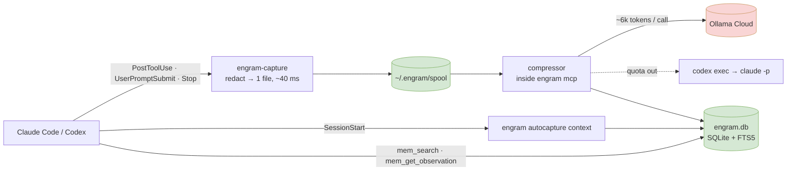

<h1 align="center">quipu</h1>

<p align="center">
  <b>Memory for Claude Code and Codex that writes itself — a fork of <a href="https://github.com/Gentleman-Programming/engram">engram</a>.</b>
</p>

<p align="center">
  
  
  
  
</p>

---

[engram](https://github.com/Gentleman-Programming/engram) is a single Go binary with SQLite + FTS5 memory behind an MCP server: the agent calls `mem_save`, later sessions call `mem_search`. That works when the agent remembers to save — and misses everything it doesn't: long sessions, subagents, whatever happened before a compaction.

quipu keeps all of engram and adds a second write path that needs no discipline from the agent. Hooks record what the agent **did** (edits, commands, prompts, turn ends); a cheap cloud model compresses that into a few engram records per batch; the next session in the same repository starts with them. Agent-written memories still rank first.

> A *quipu* is the Inca record of knotted cords — memory kept without writing.

## What it adds to engram

| | |
|---|---|
| **Capture hooks** | `engram-capture`, a 3 MB binary run by Claude Code and Codex after every tool call, prompt and turn end. It writes one redacted JSON file into `~/.engram/spool/` and exits: ~40 ms on Windows, `async`, no store, no server. Reads become content-free *touches* (which file, not what was in it). |
| **Secret redaction** | API keys, tokens, JWTs, URL credentials, `.env` / YAML / JSON secrets, `Authorization` headers, PEM blocks and BIP-39 seed phrases are replaced with `[SECRET:{type}]` *before* anything is written to disk. Tuned on 49k real records so prose ("password: encrypted by the store") survives. `<private>…</private>` is dropped. |
| **Compressor** | Runs inside `engram mcp` (one lease, any number of sessions). Batches a session's events into at most 8 records per call — decision, architecture, bugfix, config, pattern, feature, discovery — plus a rolling session summary (`topic_key session/<id>`). ~6.4k input tokens per call; finished chunks are never redone. |
| **Model chain** | Ollama Cloud (`deepseek-v4.1-flash`, then `glm-5.3-flash`) through the native `/api/chat`, JSON validated locally with one repair round. When the Ollama quota runs out: **Codex** (`gpt-6-luna`, your ChatGPT plan), then **Claude** (`claude-sonnet-5-5`, effort high, your Claude plan). 429 backs off 15 min → 2 h, a bad credential disables only its own provider, hourly budgets cap the paid fallbacks. |
| **Session-start memory** | A SessionStart hook injects ≤ ~800 tokens for **this repository only**: this session's own summary (after a resume or compaction), the last other sessions labelled by id and age ("may still be running" when recent), then record titles, agent-written first. An unknown or ambiguous directory gets nothing rather than a guess. Other projects stay reachable on request: `mem_search(all_projects=true)`. |
| **Per-event project attribution** | One session that edits four repositories writes to four projects: the edited file, a `cd` / `Set-Location` / `git -C` in the command, absolute paths, then the shell's own cwd — only repository-backed answers count; worktrees fold into their repository. |
| **Project profile** | One `project_profile` record per repository: stack from manifests (go.mod, package.json, Gradle, Cargo, csproj, Dockerfile, wrangler, …), languages and layout, commands actually run, most-touched files, and a short architecture paragraph — rebuilt daily or when a manifest changes. |
| **Codex** | Codex hooks are Claude-compatible, so the same binary captures Codex: `exec` commands, `apply_patch` edits (target taken from the patch), prompts, turn ends. Read-only commands become touches. |
| **`engram import claude-mem`** | Moves a [claude-mem](https://github.com/thedotmack/claude-mem) database over: observations, turn summaries, prompts, original timestamps, redacted again, worktree names folded, idempotent. |

Everything else — `mem_save` with topic upserts, 3-layer search, dedupe, conflict judging, the TUI, cloud sync — is engram's and works as upstream documents it ([DOCS.md](DOCS.md), [docs/](docs)).

## How it works



Without `~/.engram/autocapture.json` the hooks do nothing and quipu behaves exactly like engram.

## Measured

On one Windows 11 machine, 7 October 2026, the same four working sessions — claude-mem until it was switched off, quipu after:

| | claude-mem | quipu |
|---|---|---|
| records per hour of work | 270–330 | 36–66 |
| notes that only retell code that was read | 65% | 29% |
| model calls that day | 2,264 | 112 |
| input tokens that day | 343.6 M (avg 152k / call) | 0.72 M (avg 6.4k / call) |
| blind audit of 60 random records: useful / noise / duplicate | 14 / 45 / 1 | 45 / 11 / 4 |

The audit was done by a separate model that saw the two samples as lists A and B. Hook cost per tool call: `engram-capture` 41 ms p50 / 46 ms p95 for an edit, 55 / 62 ms for a command with 200 KB of output — against ~120 ms for the full 30 MB `engram` binary, because on Windows process start scales with image size.

Known gaps: noise was 25% against a target under 20% — minor UI polish recorded without a cause, and the same bug written twice by two chunks of one session. The second is fixed since: a later chunk now names the record it continues and rewrites it (old text kept in the version history). Whether quipu misses facts that matter needs the recall test that is still to be built. Details: [FORK.md](FORK.md).

## Install

Windows is what is tested; the code is portable Go. Needs Go 1.25+.

```powershell
git clone https://github.com/limeflash/quipu.git
cd quipu
$bin = "$env:LOCALAPPDATA\Programs\engram"
go build -o "$bin\engram.exe" ./cmd/engram
go build -ldflags "-s -w" -o "$bin\engram-capture.exe" ./cmd/engram-capture
[Environment]::SetEnvironmentVariable('Path', [Environment]::GetEnvironmentVariable('Path','User') + ";$bin", 'User')
```

The binary keeps engram's name, so upstream docs, hooks and `engram setup` keep applying.

**Switch capture on and give it a model:**

```powershell
New-Item -ItemType Directory -Force "$HOME\.engram" | Out-Null
Set-Content "$HOME\.engram\autocapture.json" '{}'          # the opt-in switch; settings below
# Ollama key from https://ollama.com/settings/keys — in a file, never in the config:
Set-Content "$HOME\.engram\ollama.key" '<your key>'        # or OLLAMA_API_KEY
```

Optional fallbacks: Codex works if `codex` is installed and logged in. For Claude, run `claude setup-token` and save the token to `~/.engram/claude.token` — a token inherited from a running session is deliberately not used.

**Claude Code:** merge [`docs/fork/claude-settings.json`](docs/fork/claude-settings.json) into `~/.claude/settings.json` (capture on PostToolUse / UserPromptSubmit / Stop, memory on SessionStart), then register the MCP server. The tool list leaves out `mem_save`, so the agent reads memory without being told to write it — drop `--tools` to get engram's full set:

```powershell
claude mcp add engram -s user -- "$env:LOCALAPPDATA\Programs\engram\engram.exe" mcp --tools=mem_search,mem_context,mem_get_observation,mem_timeline,mem_current_project,mem_list_projects
```

**Codex:** append [`docs/fork/codex-config.toml`](docs/fork/codex-config.toml) to `~/.codex/config.toml` with your user name filled in. Codex asks to trust new hooks once — start an interactive `codex` and approve them.

**Coming from claude-mem:**

```powershell
engram import claude-mem --dry-run --root C:\path\to\your\repos   # shows the project mapping first
engram import claude-mem --root C:\path\to\your\repos
```

`--root` lets engram name each project the way it names live sessions (git remote, worktrees); `--map old=new` renames the rest.

## Use

```powershell
engram autocapture status        # spool depth, provider state, calls / tokens / records per day
engram autocapture probe         # one tiny call to every backend in the chain
engram autocapture drain         # process the spool now (engram mcp does it every 60 s)
engram autocapture drain --dry-run   # run the model on the spool without writing — for prompt changes
engram autocapture profile [dir] # rebuild one repository's profile
engram search "query" --project <name>
engram tui
```

In a session the agent uses the MCP tools; asking "what did we decide about X in project Y" makes it call `mem_search` with `all_projects=true`.

## Configuration

`~/.engram/autocapture.json` — every field optional:

```json
{
  "ollama":  { "models": ["deepseek-v4.1-flash", "glm-5.3-flash"], "think": ["glm-"] },
  "codex":   { "enabled": true, "model": "gpt-6-luna", "effort": "max",  "max_calls_per_hour": 20 },
  "claude":  { "enabled": true, "model": "claude-sonnet-5-5", "effort": "high", "max_calls_per_hour": 20 },
  "language": "English",
  "max_batch_chars": 24000,
  "max_events": 40,
  "idle_minutes": 10,
  "interval_secs": 60
}
```

`language` is the language records are written in — set it to the one you search in. Files next to it: `ollama.key`, `claude.token`, `autocapture-state.json` (provider back-off), `autocapture.log` (one line per model call), `spool/`, `touches.jsonl` (activity for profiles), `profiles.json`.

## Privacy

Redaction happens in the hook, before the event touches the disk. What leaves the machine is the compressor's batches — to Ollama Cloud, or, when the fallbacks fire, to OpenAI through your Codex login and to Anthropic through your Claude plan. Reads are never sent with their contents. Memory itself stays in the local `~/.engram/engram.db`.

## Staying on upstream

Fork-only code lives in new packages (`internal/autocapture`, `internal/redact`, `cmd/engram-capture`, `cmd/engram/import_claudemem.go`); core files are touched only at a few seams, so:

```bash
git remote add upstream https://github.com/Gentleman-Programming/engram.git
git fetch upstream && git rebase upstream/main
```

On a conflict in `README.md`, keep this one. The design, milestones and every measurement are in [FORK.md](FORK.md) and [docs/fork/DESIGN.md](docs/fork/DESIGN.md).

## License

MIT, as upstream — see [LICENSE](LICENSE). engram is © Alan Buscaglia and contributors.
